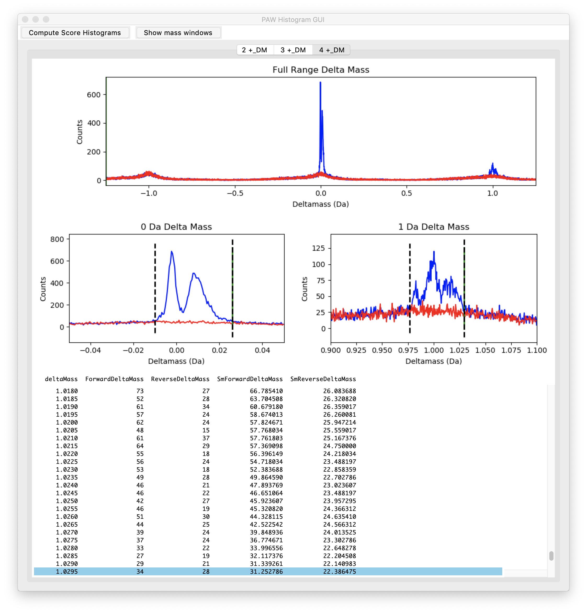

# Sea_lion_urine_SpC

## Phil Wilmarth, OHSU
### July 2019

## Objectives and overview

This repository will demonstrate using the sensitive and accurate Comet/PAW pipeline to process California sea lion urine from publicly available data associated with a recent Journal of Proteomics paper by Dr. Ben Neely and collaborators. Jupyter notebooks, R, and edgeR will be used to perform statistical analysis of the spectral counting results.

**The analysis will:**
- find and prepare a protein database for searching
- convert the RAW files for searching
- configure Comet with appropriate parameters and run searches
- prepare top-hit summary files
- set score thresholds to achieve desired PSM FDR
- write new files with only confident PSMs
- infer parsimonious protein identification lists
- group homologous proteins (an extended parsimony step)
- perform statistical analysis for differential expression
- build a usable results spreadsheet

## Dataset description

The data is from a recent study (**Ref-1**) where urine samples from California sea lions with and without leptospirosis (a kidney disease caused by bacterial infection) were compared. The study had 8 control animals and 11 infected animals. The urine was collected, digested with trypsin, and characterized with label-free shotgun proteomics. Nano-flow liquid chromatography electrospray was coupled to a Thermo Lumos Fusion mass spectrometer. The instrument acquired data in a high-high mode using HCD fragmentation  There were about 65K MS2 scans acquired per sample for a total of 1.3 million MS2 scans in the dataset. The data are available from PRIDE archive [PXD009019](https://www.ebi.ac.uk/pride/archive/projects/PXD009019).

## Goals

The goal here is to demonstrate how to analyze shotgun proteomics data with a modern open source pipeline and test for differential expression with label-free spectral counting quantification. The [PAW pipeline](https://github.com/pwilmart/PAW_pipeline.git) (**Ref-2**) uses MSConvert from [Proteowizard toolkit](http://proteowizard.sourceforge.net/) (**Ref-3**) to convert Thermo RAW files into MS2 format files (**Ref-4**). Database searching is done with the [Comet search engine]() (**Ref-5**). Python scripts process the Comet results using an interactive, visual approach to controlling PSM errors. Protein inference uses basic and extended parsimony logic to maximize the quantitative information content from shotgun data.   

The PAW pipeline has particular strengths for TMT labeling experiments, but was originally developed for large-scale spectral counting (**Ref 6**) studies. Many examples of TMT data analysis can be found [**here**](https://github.com/pwilmart/TMT_analysis_examples.git). An analysis of a very large spectral counting study can be found [**here**](https://github.com/pwilmart/Smith_SpC_2018.git). The Bioconductor package edgeR (**Ref-7**) will be used for differential expression statistical testing.

> **1.** Neely, B.A., Prager, K.C., Bland, A.M., Fontaine, C., Gulland, F.M. and Janech, M.G., 2018. Proteomic Analysis of Urine from California Sea Lions (Zalophus californianus): a Resource for Urinary Biomarker Discovery. Journal of proteome research, 17(9), pp.3281-3291. [**link**](https://pubs.acs.org/doi/abs/10.1021/acs.jproteome.8b00416)

> **2.** Wilmarth, P.A., Riviere, M.A. and David, L.L., 2009. Techniques for accurate protein identification in shotgun proteomic studies of human, mouse, bovine, and chicken lenses. Journal of ocular biology, diseases, and informatics, 2(4), pp.223-234. [**link**](https://link.springer.com/article/10.1007/s12177-009-9042-6)

> **3.** Chambers, M.C., Maclean, B., Burke, R., Amodei, D., Ruderman, D.L., Neumann, S., Gatto, L., Fischer, B., Pratt, B., Egertson, J. and Hoff, K., 2012. A cross-platform toolkit for mass spectrometry and proteomics. Nature biotechnology, 30(10), p.918. [**link**](https://www.nature.com/articles/nbt.2377)

> **4.** McDonald, W.H., Tabb, D.L., Sadygov, R.G., MacCoss, M.J., Venable, J., Graumann, J., Johnson, J.R., Cociorva, D. and Yates III, J.R., 2004. MS1, MS2, and SQT—three unified, compact, and easily parsed file formats for the storage of shotgun proteomic spectra and identifications. Rapid Communications in Mass Spectrometry, 18(18), pp.2162-2168. [**link**](https://onlinelibrary.wiley.com/doi/abs/10.1002/rcm.1603)

> **5.** Eng, J.K., Jahan, T.A. and Hoopmann, M.R., 2013. Comet: an open‐source MS/MS sequence database search tool. Proteomics, 13(1), pp.22-24. [**link**](https://onlinelibrary.wiley.com/doi/abs/10.1002/pmic.201200439)

> **6.** Liu, H., Sadygov, R.G. and Yates, J.R., 2004. A model for random sampling and estimation of relative protein abundance in shotgun proteomics. Analytical chemistry, 76(14), pp.4193-4201.

> **7.** Robinson, M.D., McCarthy, D.J. and Smyth, G.K., 2010. edgeR: a Bioconductor package for differential expression analysis of digital gene expression data. Bioinformatics, 26(1), pp.139-140.

---

## Protein database details

When (**Ref-1**) was published, the California sea lion (taxon = 9704) genome was not available. FASTA files from two related species (Weddell seal and Pacific walrus) were used instead. Part of the motivation for this re-analysis was to use the sea lion genome. The FASTA sequences are available from the NCBI website by searching for taxon id of 9704. Results should be further filtered to the RefSeq entries. There will be around 59,174 sequences that can be downloaded in FASTA format. The FASTA file will have some sequence redundancy. NCBI has recently [added an option](https://www.ncbi.nlm.nih.gov/ipg/docs/about/) to download non-redundant sequence sets. A Python script (`remove_duplicates.py`) is part of the [fasta_utilities](https://github.com/pwilmart/fasta_utilities.git) tools and was used to collapse duplicate sequences and reduce the database to 45,800 sequences. The `add_extras_and_reverse.py` tool was used to add sequences for the retention time standard and a couple of spike-in proteins available from the [PXD009019](https://www.ebi.ac.uk/pride/archive/projects/PXD009019) archive. The final database (with the 3 extra sequences, 179 common contaminants, and sequence-reversed versions of all) was 91,964 sequences.

## PAW processing

The README.md file in [PAW_pipeline](https://github.com/pwilmart/PAW_pipeline.git) repository describes the pipeline in detail including installation instructions. The first step is to convert the RAw files to MS2-format files using [`msconvert_GUI.py`](https://github.com/pwilmart/PAW_pipeline/blob/master/docs/msconvert_GUI.md). The default settings were used with MS2 selected for the data to extract. There were an average of 66,431 MS2 scans per LC run (SD = 4,845; max = 71,966; min = 50,459) for a total dataset size of 1,262,185 MS2 scans.

Comet was configured for a semi-tryptic search using the FASTA file described above for sea lion. Semi-trpytic searches should be used for any biofluid samples (serum, plasma, saliva, urine, CSF, CVF, sweat, tear, etc.) as endogenous proteases, signal peptide removal and other protein processing can results in peptides that are not fully tryptic with respect to the sequence in the FASTA file. These searches increase search space and take longer than regular tryptic searches. Some other key Comet parameters are listed below:

- parent ion mass tolerance of 1.25 Da
- fragment ion tolerance of 0.02 Da (for for high resolution MS2 data)
- monoisotopic masses
- maximum of two missed cleavages
- variable oxidation of Met
- static alkylation of Cys

The top-hit summaries are generated with the script `sqt_converter.py`. **This step is currently extremely slow.** The script only uses a single core. Comet (version 2016.3) does not list all proteins that peptides match to. It lists the first one (which might be the only one) and the number of additional matches. When the database is larger, or has higher degrees of peptide redundancy, peptide lookups take longer. Fully tryptic peptide lookup is fast since that is done using a dictionary of a theoretical digest of the FASTA file. Semi-tryptic sequence use a slower brute force scan of all protein sequences.

After a few days on my iMac, the top-hit summary files could be loaded into the [`histo_GUI.py`](https://github.com/pwilmart/PAW_pipeline/blob/master/docs/histo_GUI.md) application. It is worth pointing out that a top-hit summary does not mean one sequence per MS2 spectrum. There can be different sequences that tie on score. The `histo_GUI.py` script separates peptides in various subclasses by:

- charge state (2+, 3+, and 4+ for OrbiTraps)
- number of tryptic termini (2 for fully-tryptic, 1 for semi-tryptic)
- modification state (no mods or oxidized Met)

When semi-tryptic searches are used, a given peptide sequence can be fully-tryptic in some protein sequences and semi-trpytic in others. The N-terminal tryptic cleavage site is inferred from the protein sequence not from the peptide sequence. This means that some top hits can be both fully tryptic and semi-tryptic and be associated with more than one peptide subclass. Another complicated situation is when more than one variable modification is used. Modifications can be homogeneous or heterogeneous. Then the question becomes what peptide subclass histogram to put the score in. We had just one variable modification, so we did not have to worry about that here.

---

## Delta mass windows

The first step in the `histo_GUI.py` processing is to make delta mass histograms. Comet/PAW is designed for wider tolerance searches so that accurate mass can be used to distinguish correct matches from incorrect matches (using the decoy sequences as noise proxies). We expect most correct matches to have accurate masses and have the measured masses be within a few PPM of the calculated peptide sequence masses. That will be a sharp peak in the delta mass histogram near zero Da. We used plus/minus 1.25 Da. We will plot a histogram for the full range, for the region around zero Da, and for a region around one Da. We will do separate delta mass histograms by charge state. This is the 2+ ions:

We see that we have some mass calibration issues with this data. We do not have a single peak at zero Da, but a doublet instead. We are getting some valuable quality control information for free. The data were acquired on two days: 20170525 and 20170619, about a month apart. Here are the same 2+ delta mass histograms for the 20170525 runs:

Here are the 2+ delta mass histograms for the 20170619 runs:

Each set of runs is okay. There is a single peak at zero Da and two peaks at one Da. The first peak at 0.984 Da is from deamidation (typically NG motifs). The second peak at 1.003 is from C13 triggers (instead of the monoisotopic peak). The earlier set of runs is not as good as the second set. The zero Da peak is wider and has a more pronounced right-hand tail. We could separate the data by date and filter the PSMs in two sets. The data can easily be combined in downstream steps. However, the PAW approach is flexible enough to handle the messier combined data.

---

The `histo_GUI.py` program makes discrimiant score histograms conditioned on the delta mass windows. We will make separate score histograms for the delta masses inside the zero Da window (inside the dotted lines), inside the one Da window (typically around two peaks), and scores for PSMs that did not fall inside either window. We will have to set a little wider windows to accommodate the mass calibration errors. This will only have a small adverse effect on the sensitivity.

Here are the histograms for the 3+ PSMs:

And, finally, the 4+ ions:

---

## Conditional score histograms

### Zero Da delta mass windows

Once we have the delta mass windows adjusted to capture the peaks of interest, we can create the conditional score histograms. The GUI will use multi-tabbed windows to accommodate the numerous peptide subclasses. I usually work in a left-to-right fashion, so here are the 2+ unmodified peptides for the zero Da peptides:

The histograms of the decoy matches are in red and the matches to the target sequences are in blue. The dotted lines are the 1% FDR cutoffs. We see that we do, indeed, have many semi-tryptic correct peptides.

These are the same charge and delta mass for the oxidized Met peptides:

These are the 3+ unmodified peptides in the zero Da window:

And for the oxidized Met peptides:

Here are the images for the 4+ peptides in the zero Da window:

Some general observations: the decoy distributions accurately model the shape (position, width, and magnitude) of the incorrect part of the target distributions, there are many more unmodified peptides than oxidized Met peptides, and there are more incorrect matches for semi-trpytic peptides because their search space is larger (random matches will be proportional to the size of the search space for each peptide subclass).

---

### One Da delta mass windows

The one Da windows have different signal-to-noise. The one Da peaks are typically much smaller than the zero Da peak, yet they sit on about the same noise level. We will have the unmodified peptides fist then the oxidized Met peptides. The 2+ first:

The 3+ peptides:

And the 4+ peptides for the one Da window:

Things are generally similar to the zero Da distributions, but the overall numbers of correct matches is smaller. We have a little more noise (larger relative red distributions compared to the blue), so we have to set a little higher score cutoffs to keep the 1% FDR.

---

### PSMs without an accurate mass

Interestingly, not all peptides selected for sequencing in OrbiTraps actually have an accurate measured mass (and maybe not a defined charge state). How many of these we may have depends on many factors: instrument settings, sample composition, etc. The 2+ first:

The 3+ peptides:

And the 4+ peptides for the one Da window:

Things are generally similar to the other subclass distributions, but the overall numbers of correct matches are usually smaller. We have a considerably more noise (larger relative red distributions compared to the blue), so we have to set higher score cutoffs to keep the 1% FDR. For this data, we have quite a few "extra" matches that we would have lost if we had strictly required accurate masses.

---

## PSM statistics

The PAW filtering requires that peptides be at least 7 amino acids in length. Charge states of 2+, 3+, and 4+ are allowed for high resolution data. Each peptide subclass is filtered independently to a 1% FDR so that an overall dataset FDR of 1% can be obtained. We can tally the numbers of net correct matches in the various subclasses to see what the data characteristics are. There were 1,262,185 MS2 scans in total. There were 248,853 scans that exceeded the discriminant score thresholds. The overall ID rate was 19.7%

**Delta mass windows**

Window|Scans|Fraction
------|-----|--------
Zero Da|181,572|73.8%
One Da|30,321|12.3%
Outside|34,060|13.8%

**Charge states**

Charge|Scans|Fraction
------|-----|--------
2+|132,889|54.0%
3+|93,579|38.0%
4+|19,485|7.9%

**Number of tryptic termini**

NTT|Scans|Fraction
------|-----|--------
Full|200,295|81.4%
Semi|45,658|18.6%

**Modification state**

State|Scans|Fraction
------|-----|--------
no Mods|209,580|85.2%
ox Met|36,373|14.8%

We have 3/4 of the identifications falling inside of the zero Da delta mass window. Surprisingly, we have more identifications without an accurate mass than there were in the one Da delta mass window. There are mostly 2+ and 3+ peptides with far fewer 4+ peptides. This is pretty typical for trypsin digests. We have appreciable numbers of semi-trpytic and oxidized Met identifications. The concern with not including these peptide forms in the search settings is that their fraction per sample may not be the same between conditions. Ignoring them could introduce some bias into the measurements.  

---

## Protein inference

The PAW pipeline implements a very basic parsimony framework. Proteins having indistinguishable peptide sets (considering I and L residues indistinguishable) are grouped together. Proteins with peptide sets that are formal subsets of other protein peptide sets are removed. The protein mapping and peptide set processing are done experiment wide. The minimum number of distinct peptides per protein (almost always two) criterion is applied per sample (not experiment wide).

**Proteins at each step (includes contaminants)**

Step|Proteins|Decoys
----|--------|------
Raw mapping|15,533|
Excluding one peptide per protein|6,434|
After redundant grouping|3,687|
After subset removal|2,803|
2 peptides/protein/sample|2,407|21
After homology grouping|2,336|21

We see that the 1% PSM FDR cutoff resulted in a similar 1% protein FRD estimate. The protein FDR depends on the number of incorrect PSMs per sample, the effective database size, and the number of samples in the experiment. The PAW pipeline does not use ad hoc, untested, heuristic protein ranking functions. The protein FDR is a consequence of the number of incorrect PSMs being accepted. To make the protein list more or less strict, one would need to change the PSM score thresholds and redo the protein inference.

---
