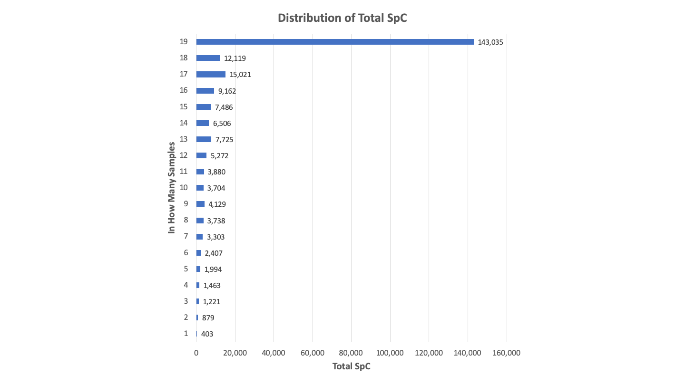

# Sea_lion_urine_SpC

## Phil Wilmarth, OHSU
### July 2019

## Dataset description and analysis overview

The data is from a recent study (**Ref-1**) by Dr. Ben Neely and collaborators where urine samples from California sea lions with and without leptospirosis (a kidney disease caused by bacterial infection) were compared. The study had 8 control animals and 11 infected animals. The urine was collected, digested with trypsin, and characterized with label-free shotgun proteomics. Nano-flow liquid chromatography electrospray was coupled to a Thermo Lumos Fusion mass spectrometer. The instrument acquired data in a high-high mode using HCD fragmentation  There were about 65K MS2 scans acquired per sample for a total of 1.3 million MS2 scans in the dataset. The data are available from PRIDE archive [PXD009019](https://www.ebi.ac.uk/pride/archive/projects/PXD009019).

**The analysis will:**
- find and prepare a protein database for searching
- convert the RAW files for searching
- configure Comet with appropriate parameters and run searches
- prepare top-hit summary files
- set score thresholds to achieve desired PSM FDR
- write new files with only confident PSMs
- infer parsimonious protein identification lists
- group homologous proteins (an extended parsimony step)
- perform statistical analysis for differential expression
- build a usable results spreadsheet

I will demonstrate analyzing shotgun proteomics data with a modern open source pipeline and testing for differential expression with label-free spectral counting quantification. The [PAW pipeline](https://github.com/pwilmart/PAW_pipeline.git) (**Ref-2**) uses MSConvert from [Proteowizard toolkit](http://proteowizard.sourceforge.net/) (**Ref-3**) to convert Thermo RAW files into MS2 format files (**Ref-4**). Database searching is done with the [Comet search engine](http://comet-ms.sourceforge.net/) (**Ref-5**). Python scripts process the Comet results using an interactive, visual approach to controlling PSM errors. Protein inference uses basic and extended parsimony logic to maximize the quantitative information content from shotgun data.   

The PAW pipeline has particular strengths for TMT labeling experiments, but was originally developed for large-scale spectral counting (**Ref-6**) studies. Many examples of TMT data analysis can be found [**here**](https://github.com/pwilmart/TMT_analysis_examples.git). An analysis of a very large spectral counting study can be found [**here**](https://github.com/pwilmart/Smith_SpC_2018.git). The Bioconductor package edgeR (**Ref-7**) will be used for differential expression statistical testing.

---

## References

> **1.** Neely, B.A., Prager, K.C., Bland, A.M., Fontaine, C., Gulland, F.M. and Janech, M.G., 2018. Proteomic Analysis of Urine from California Sea Lions (Zalophus californianus): a Resource for Urinary Biomarker Discovery. Journal of proteome research, 17(9), pp.3281-3291. [**link**](https://pubs.acs.org/doi/abs/10.1021/acs.jproteome.8b00416)

> **2.** Wilmarth, P.A., Riviere, M.A. and David, L.L., 2009. Techniques for accurate protein identification in shotgun proteomic studies of human, mouse, bovine, and chicken lenses. Journal of ocular biology, diseases, and informatics, 2(4), pp.223-234. [**link**](https://link.springer.com/article/10.1007/s12177-009-9042-6)

> **3.** Chambers, M.C., Maclean, B., Burke, R., Amodei, D., Ruderman, D.L., Neumann, S., Gatto, L., Fischer, B., Pratt, B., Egertson, J. and Hoff, K., 2012. A cross-platform toolkit for mass spectrometry and proteomics. Nature biotechnology, 30(10), p.918. [**link**](https://www.nature.com/articles/nbt.2377)

> **4.** McDonald, W.H., Tabb, D.L., Sadygov, R.G., MacCoss, M.J., Venable, J., Graumann, J., Johnson, J.R., Cociorva, D. and Yates III, J.R., 2004. MS1, MS2, and SQT—three unified, compact, and easily parsed file formats for the storage of shotgun proteomic spectra and identifications. Rapid Communications in Mass Spectrometry, 18(18), pp.2162-2168. [**link**](https://onlinelibrary.wiley.com/doi/abs/10.1002/rcm.1603)

> **5.** Eng, J.K., Jahan, T.A. and Hoopmann, M.R., 2013. Comet: an open‐source MS/MS sequence database search tool. Proteomics, 13(1), pp.22-24. [**link**](https://onlinelibrary.wiley.com/doi/abs/10.1002/pmic.201200439)

> **6.** Liu, H., Sadygov, R.G. and Yates, J.R., 2004. A model for random sampling and estimation of relative protein abundance in shotgun proteomics. Analytical chemistry, 76(14), pp.4193-4201. [**link**](https://pubs.acs.org/doi/abs/10.1021/ac0498563)

> **7.** Robinson, M.D., McCarthy, D.J. and Smyth, G.K., 2010. edgeR: a Bioconductor package for differential expression analysis of digital gene expression data. Bioinformatics, 26(1), pp.139-140. [**link**](https://academic.oup.com/bioinformatics/article/26/1/139/182458)

---

## Contents

- [Protein database details](#database)
- [PAW processing](#PAW_processing)
- [Delta mass windows](#accurate_mass)
- [Conditional score histograms](#score_histos)
- [PSM statistics](#psm_stats)
- [Protein inference](#protein_inference)
- [Files in the repository](#repo_files)
- [Protein identification overview](#ID_overview)
- [Quantitative data prep](#quant_prep)
- [Differential expression results](#DE_results)
- [Summary](#summary)

##  Protein database details

When (**Ref-1**) was published, the California sea lion (taxon = 9704) genome was not available. FASTA files from two related species (Weddell seal and Pacific walrus) were used instead. Part of the motivation for this re-analysis was to use the sea lion genome. The FASTA sequences are available from the NCBI website by searching for taxon id of 9704. Results should be further filtered to the RefSeq entries. There will be around 59,174 sequences that can be downloaded in FASTA format. The FASTA file will have some sequence redundancy. NCBI has recently [added an option](https://www.ncbi.nlm.nih.gov/ipg/docs/about/) to download non-redundant sequence sets (not recommended, see below). A Python script (`remove_duplicates.py`) is part of the [fasta_utilities](https://github.com/pwilmart/fasta_utilities.git) tools and was used to collapse duplicate sequences and reduce the database to 45,800 sequences. The `add_extras_and_reverse.py` tool was used to add sequences for the retention time standard and a couple of spike-in proteins available from the [PXD009019](https://www.ebi.ac.uk/pride/archive/projects/PXD009019) archive. The final database (with the 3 extra sequences, 179 common contaminants, and sequence-reversed versions of all) was 91,964 sequences.

> The NCBI "Identical Protein Groups" download options has some unexpected side effects. Since I was interested in the California Sea lion, and had filtered NCBI for RefSeq only for taxonomy number 9704, I assumed that the non-redundant download would have the FASTA headers for Sea lion. It does not. It probably has the first header element in the full nr database for each sequence. When a single, unique protein sequence is added to the nr collection, all of the different FASTA headers associated with that sequence are joined (with a Control-A character as a separator) into a very large FASTA header line. There is some "species pecking order" to this process. These non-redundant sequence collections will have the correct set of non-redundant protein sequences, but the FASTA headers (accessions and descriptions) will be an interesting hodgepodge of species.

##  PAW processing

The README.md file in [PAW_pipeline](https://github.com/pwilmart/PAW_pipeline.git) repository describes the pipeline in detail including installation instructions. The first step is to convert the Thermo RAW files to MS2-format files using [`msconvert_GUI.py`](https://github.com/pwilmart/PAW_pipeline/blob/master/docs/msconvert_GUI.md). The default settings were used with MS2 selected for the data to extract. There were an average of 66,431 MS2 scans per LC run (SD = 4,845; max = 71,966; min = 50,459) for a total dataset size of 1,262,185 MS2 scans.

Comet was configured for a semi-tryptic search using the FASTA file described above for sea lion. Semi-trpytic searches should be used for any biofluid samples (serum, plasma, saliva, urine, CSF, CVF, sweat, tear, etc.) as endogenous proteases, signal peptide removal and other protein processing can results in peptides that are not fully tryptic with respect to the sequence in the FASTA file. These searches increase search space and take longer than regular tryptic searches. Some other key Comet parameters are listed below:

- parent ion mass tolerance of 1.25 Da
- fragment ion tolerance of 0.02 Da (for for high resolution MS2 data)
- monoisotopic masses
- maximum of two missed cleavages
- variable oxidation of Met
- static alkylation of Cys

The full list of Comet parameters can be found in the `comet.params` file.

> Urine as a biofluid has some other challenges compared to samples like serum. Urine is a very dynamic proteome (ever eat asparagus?), so sample-to-sample variability (even within the same condition) can be high. Sample collection and processing protocols will probably need some effort to reduce variability. Urine proteins can also be heavily glycosylated. Detecting glycosylated peptides in shotgun studies is very, very hard. They will mostly be missed. If the rate of glycosylation is similar between conditions, then this is just a reduced sensitivity issue. However, gylcosylation is implicated in many diseases, so assuming similar glycosylation between conditions may not always be true.

The top-hit summaries are generated with the script `sqt_converter.py`. This step is **extremely slow** in software hosted at Github before August, 4, 2019. The newest version expands the peptide lookup dictionaries to include N- and C-terminal tags and the performance is adequate. The script uses a single core and large lookup dictionaries. Comet (version 2016.3) does not list all proteins that peptides match to. It lists the first one (which might be the only one) and the number of additional matches. When the database is larger, or has higher degrees of peptide redundancy, peptide lookups take longer. Peptide lookup is sped up by using large dictionaries of a theoretical digest of the entire FASTA file.

After a few days on my iMac, the top-hit summary files could be loaded into the [`histo_GUI.py`](https://github.com/pwilmart/PAW_pipeline/blob/master/docs/histo_GUI.md) application. It is worth pointing out that a top-hit summary does not mean one sequence per MS2 spectrum. There can be different sequences that tie on score. The `histo_GUI.py` script separates peptides in various subclasses by:

- charge state (2+, 3+, and 4+ for OrbiTraps)
- number of tryptic termini (2 for fully-tryptic, 1 for semi-tryptic)
- modification state (no modifications or oxidized Met in this case)

When semi-tryptic searches are used, a given peptide sequence can be fully-tryptic in some protein sequences and semi-trpytic in others. The N-terminal tryptic cleavage site is inferred from the protein sequence, not from the peptide sequence. This means that some top hits can be both fully tryptic and semi-tryptic and be associated with more than one peptide subclass. Another complicated situation is when more than one variable modification is used. Modifications can be homogeneous or heterogeneous. Then the question becomes what peptide subclass histogram to put the score in. We had just one variable modification, so we did not have to worry about that here.

---

##  Delta mass windows

The first step in the `histo_GUI.py` processing is to make delta mass histograms. Comet/PAW is designed for wider tolerance searches so that accurate mass can be used to distinguish correct matches from incorrect matches (using the decoy sequences as noise proxies). We expect most correct matches to have accurate masses and have the measured masses be within a few PPM of the calculated peptide sequence masses. That will be a sharp peak in the delta mass histogram near zero Da. We used plus/minus 1.25 Da. We will plot a histogram for the full range, for the region around zero Da, and for a region around one Da. We will do separate delta mass histograms by charge state. This is the 2+ ions:

We see that we have some mass calibration issues with this data. We do not have a single peak at zero Da, but a doublet instead. We are getting some valuable quality control information for free. The data were acquired on two days: 20170525 and 20170619, about a month apart. Here are the same 2+ delta mass histograms for the 20170525 runs:

Here are the 2+ delta mass histograms for the 20170619 runs:

Each set of runs is okay. There is a single peak at zero Da and two peaks at one Da. The first peak at 0.984 Da is from deamidation (typically NG motifs). The second peak at 1.003 is from C13 triggers (instead of the monoisotopic peak). The earlier set of runs is not as good as the second set. The zero Da peak is wider and has a more pronounced right-hand tail. We could separate the data by date and filter the PSMs in two sets. The data can easily be combined in downstream steps. However, the PAW approach is flexible enough to handle the messier combined data.

---

The `histo_GUI.py` program makes discrimiant score histograms conditioned on the delta mass windows. We will make separate score histograms for the delta masses inside the zero Da window (inside the dotted lines), inside the one Da window (typically around two peaks), and scores for PSMs that did not fall inside either window. We will have to set a little wider windows to accommodate the mass calibration errors. This will only have a small adverse effect on the sensitivity.

Here are the histograms for the 3+ PSMs:

And, finally, the 4+ ions:

---

##  Conditional score histograms

### Zero Da delta mass windows

Once we have the delta mass windows adjusted to capture the peaks of interest, we can create the conditional score histograms. The scores used in the histograms are [PeptideProphet-like](https://pubs.acs.org/doi/abs/10.1021/ac025747h) discriminant functions. The sensitivity of this (non-optimized) static classifier method is generally equal to or slightly better than [Percolator](https://www.nature.com/articles/nmeth1113). The GUI will use multi-tabbed windows to accommodate the numerous peptide subclasses. I usually work in a left-to-right fashion, so here are the 2+ unmodified peptides for the zero Da peptides:

The histograms of the decoy matches are in red and the matches to the target sequences are in blue. The dotted lines are the 1% FDR cutoffs. We see that we do, indeed, have many semi-tryptic correct peptides.

These are the same charge and delta mass for the oxidized Met peptides:

These are the 3+ unmodified peptides in the zero Da window:

And for the oxidized Met peptides:

Here are the screen captures for the 4+ peptides in the zero Da window:

Some general observations: the decoy distributions accurately model the shape (position, width, and magnitude) of the incorrect part of the target distributions, there are many more unmodified peptides than oxidized Met peptides, and there are more incorrect matches for semi-trpytic peptides because their search space is larger (random matches will be proportional to the size of the search space for each peptide subclass).

---

### One Da delta mass windows

The one Da windows have different signal-to-noise. The one Da peaks are typically much smaller than the zero Da peak, yet they sit on about the same noise level. We will have the unmodified peptides fist then the oxidized Met peptides. The 2+ first:

The 3+ peptides:

And the 4+ peptides for the one Da window:

Things are generally similar to the zero Da distributions, but the overall numbers of correct matches is smaller. We have a little more noise (larger relative red distributions compared to the blue), so we have to set a little higher score cutoffs to keep the 1% FDR.

---

### PSMs without an accurate mass

Interestingly, not all peptides selected for sequencing in OrbiTraps actually have an accurate measured mass (and maybe not a defined charge state). How many of these we may have depends on many factors: instrument settings, sample composition, etc. The 2+ peptides first:

The 3+ peptides outside of windows:

And the 4+ peptides outside of windows:

Things are generally similar to the other subclass distributions, but the overall numbers of correct matches are usually smaller. We have a considerably more noise (larger relative red distributions compared to the blue), so we have to set higher score cutoffs to keep the 1% FDR. For this data, we have quite a few "extra" matches that we would have lost if we had required strict accurate masses.

---

##  PSM statistics

The PAW filtering requires that peptides be at least 7 amino acids in length. Charge states of 2+, 3+, and 4+ are allowed for high resolution data. Each peptide subclass is filtered independently to a 1% FDR so that an overall dataset FDR of 1% can be obtained. We can tally the numbers of net correct matches in the various subclasses to see what the data characteristics are. There were 1,262,185 MS2 scans in total. There were 248,853 scans that exceeded the discriminant score thresholds. The overall ID rate was 19.7%

**Delta mass windows**

Window|Scans|Fraction
------|-----|--------
Zero Da|181,572|73.8%
One Da|30,321|12.3%
Outside|34,060|13.8%

**Charge states**

Charge|Scans|Fraction
------|-----|--------
2+|132,889|54.0%
3+|93,579|38.0%
4+|19,485|7.9%

**Number of tryptic termini**

NTT|Scans|Fraction
------|-----|--------
Full|200,295|81.4%
Semi|45,658|18.6%

**Modification state**

State|Scans|Fraction
------|-----|--------
no Mods|209,580|85.2%
ox Met|36,373|14.8%

We have 3/4 of the identifications falling inside of the zero Da delta mass window. Surprisingly, we have more identifications **without an accurate mass** than there were in the one Da delta mass window. There are mostly 2+ and 3+ peptides with far fewer 4+ peptides. This is pretty typical for trypsin digests. We have appreciable numbers of semi-trpytic and oxidized Met identifications. The concern with not including these peptide forms in the search settings is that their relative fractions per sample may not be the same between different samples/conditions. Ignoring them could introduce some bias into the measurements.  

> I repeated the analysis using a combined Pacific walrus and Weddell seal database instead of the Sea lion database to see the actual effect of database choice. All processing was the same as detailed above. The decrease in identified PSMs was quite dramatic. There were 142,317 PSMs, only 0.57 times as many.

---

##  Protein inference

The PAW pipeline implements a very basic parsimony framework. Proteins having indistinguishable peptide sets (considering I and L residues indistinguishable) are grouped together. Proteins with peptide sets that are formal subsets of other protein peptide sets are removed. The protein mapping and peptide set processing are done experiment wide. The minimum number of distinct peptides per protein (almost always two) criterion is applied per sample (not experiment wide).

**Proteins at each step (includes contaminants)**

Step|Proteins|Decoys
----|--------|------
Raw mapping|15,533|
Excluding one peptide per protein|6,434|
After redundant grouping|3,687|
After subset removal|2,803|
2 peptides/protein/sample|2,407|21
After homology grouping|2,336|21

We see that the 1% PSM FDR cutoff resulted in a similar 1% protein FRD estimate. The protein FDR depends on the number of incorrect PSMs per sample, the effective database size, and the number of samples in the experiment. The PAW pipeline does not use ad hoc, untested, heuristic protein ranking functions. The protein FDR is a consequence of the number of incorrect PSMs being accepted. To make the protein list more or less strict, one would need to change the PSM score thresholds and redo the protein inference.

> The effect of using the walrus and seal database, where we had a large decrease in PSMs also decreases the number of inferred proteins. Urine is a wide dynamic range proteome. What I mean by that is that rare peptide forms from the abundant proteins are likely to be more abundant than peptides from the lowest abundance proteins. Adding peptide forms from things like PTMs, non-fully-tryptic cleavage, or more identifiable peptides (because we have the correct species database) will more likely add decorations to abundant proteins (that have already been identified) than add new protein identifications. The sea lion database had 2,262 non-redundant, grouped proteins without counting any decoys or contaminants. The walrus plus seal database reduced the number of protein identifications by 467 to 1,795. The decrease (0.79) is considerably less that the decrease at the PSM level (0.57).

---

##  Files in the repository

The entire analysis folder is 40 GB. This has RAW files, converted files from MSConvert, MS2 files for search input, SQT files from Comet, top hit summary text files, filtered MS2, SQT, and TXT files, and the results files. There are also log files written for each pipeline step. Only the results files are in the repository due to space considerations.

The `PAW_results.py` script produces several output and log files:

File(s)|Count|Description
----|-----|-----------
2017-X-Y_CSL_Z_redux_peptide_results_9.txt|19|Detailed PSM reports
peptide_summary_9.txt|1|Peptides associated with proteins
protein_summary_9.txt|1|Redundant proteins with basic parsimony
grouped_peptide_summary_9.txt|1|Peptides associated with grouped proteins
grouped_protein_summary_9.txt|1|Non-redundant proteins with extended parsimony

The `PAW_results.log` file has the protein inference details. The `PAW_protein_grouper.log` file has the extended parsimony grouping details.

The detailed PSM-level reports have search scores, masses, etc. for each PSM associated with the final parsimonious protein list (it is not all PSMs - those are in the filtered files folder which is not in the repository).

The basic peptide and protein summaries are better for information about identifications. A question faced by programmers for any proteomics result report is how to represent protein group members. Protein groups (in a basic parsimony context) are proteins indistinguishable based on their observed peptides. Some proteins ony have peptides that map back to a single entry in the FASTA file. Those are trivial cases since protein groups with single members are obvious single rows in any output table. If protein groups have more than one member, then there are choices to consider. A single representative member of the group can be used to represent the group so that each protein or protein group is a single row in an output table. That shifts the question to which protein to use as the representative one. Another choice is to wrap multiple bits of information into each cell using some scheme based on separator characters. That always complicates downstream data parsing as cells have to be tested for single items or multiple items (and then we have the question of what to do about multiple items...). The choice that I made in the PAW pipeline was to have a separate row for each group member. This is what I mean by a "redundant" protein summary. Protein group number format and a text column to denote redundant additional group members are needed to make the table structure obvious. Simple tab-delimited text files do not support tree-like views where items (protein groups) can be expanded or collapsed. These can be used in GUI table viewers but that is another topic. The peptide summaries are more non-redundant in that each protein group is represented by the integral protein group number (the protein group number can be used to relate the peptide and protein tables to each other).

The grouped protein and peptide summaries are designed for quantification in shotgun proteomics experiments. Getting good quantitative results is extremely dependent on how peptides that map to multiple proteins (shared peptides) are handled. Consider two indistinguishable proteins. That means that each peptide maps to the same two sequences in the FASTA file. Each peptide is a shared peptide in the FASTA file context. The context for thinking about whether a peptide maps to more than on protein changes after grouping indistinguishable peptide sets and removing subsets. The context for shared and unique needs to be changed to the set of proteins in the parsimonious results list. Most peptides in protein groups can become unique in the new context. There can still be peptides that are shared between protein groups (including groups with one member). We still have to know what to do with the information for the re-defined shared peptides. We can exclude them or try to somehow split their information between the protein groups that contain them.

The PAW pipeline splits the spectral counts for shared peptides based on relative unique peptide counts. This works okay when there are not too many shared peptide counts. We really need the number of shared counts that we are splitting to be "relatively" small compared to the unique counts. If the shared counts become dominant, it may be safer to combine protein groups into protein families and sacrifice some quantitative resolution for quantitative accuracy. That is what the protein grouping step does.

The protein grouping is an extension of the basic parsimony logic. A useful rule of thumb in proteomics is to require two peptides per protein. See [this blog post](https://pwilmart.github.io/blog/2019/03/10/MQ-performance) for a deeper dive into why the two peptide rule works. Two independent pieces of evidence for a protein is unlikely to happen by chance. A single incorrect peptide can have an atypical high score. There is never any guarantee that a single peptide is correct (yes, high incorrect scores are less likely but not impossible). The extended parsimony idea is that we need at least two unique peptides to keep proteins from being grouped together. We can extend the definitions of identical peptide sets to nearly identical sets (and similar thinking for subsets). There are protein forms in several established protein families (actins, tubulins, histones, keratins, etc.) that have mostly the same protein sequence. They can have small numbers of peptides that are not identical, but most of the peptides will be the same. We need to capture these cases and combine them, too. They may have sufficient unique peptide evidence to support identification of individual family members, but the total weight of the shared peptides is so large that trying to split them would be a bad idea. More details on the protein grouping algorithm can be found in [this thesis](https://digitalcollections.ohsu.edu/concern/etds/c534fp149).

The grouped protein summary file has each protein/protein group/protein family represented in a single row (a non-redundant table). The context for shared and unique peptides get updated for the new extended parsimonious protein list. The grouped protein summaries are typically used for further quantitative processing. The corresponding peptide summaries are similar to the non-grouped ones. There are some compromises to grouping. Some unique before grouping peptides get lumped in with the shared peptides for the protein family. Thus, a protein family will be represented by a protein sequence and a set of peptides where some of the peptides might not be present in that representative protein sequence. Ambiguity seems to lead to ambiguous solutions.

There are also Jupyter notebook files in `ipynb` format and as rendered `HTML` files. The R code from the notebooks has also been saved in `R` script files (can be used in RStudio).     

---

##  Protein identification overview

The number of proteins detected by the Comet/PAW processing after grouping and removal of contaminants (common contaminants and keratins) was 2,262 with a two peptide per protein requirement. The number reported in (**Ref-1**) was 2694 but appears to allow single peptide per protein IDs. The S1 tab of the Supplemental file `pr8b00416_si_002.xlsx` can be used to estimate what the protein count would have been with two peptides per protein and the number is somewhere in the 1800 to 1900 range. This is pretty impressive without having a proper sea lion protein database. From the S1 table, some idea of the total number of confident PSMs identified can be obtained by summing counts from all cells. The result is about 111 thousand PSMs. A similar sum of the PAW results file is 233 thousand. There are roughly twice as many PSMs identified with the Comet/PAW processing compared to the processing in (**Ref-1**). The non-species specific FASTA file, the mass calibrations issues, different search engine and post processing, and exclusion of semi-trpytic peptides all contribute to the lower identification number. Interestingly, such a large increase in PSMs had a much smaller effect at the protein level. Wide dynamic range proteomes like urine will have most additional lower abundance PSM identifications mapping to highly abundant proteins.

This leads into a class of common questions explored in most proteomics studies. Namely, how consistent are the proteomics results between the samples? This is a valid question nearly always answered in an invalid way. One way to sneak up on the answer to this question for this experiment is to ask how frequently was each protein seen across the 19 samples (19 out of 19, 18 out of 19, etc.). We can tabulate the number of proteins identified in given number of samples and make a plot:

We have 190 proteins out of 2262 (8%) that were seen in all 19 samples. That sure seems low. We have large numbers of proteins in all of the categories from 19/19 down to 1/19. This looks like reproducibility of the proteomics results across the samples is a TOTAL DISASTER. Any Venn diagram shown in any proteomics publication is based on counting each protein ID as an equal item. That over-represents low abundance proteins and dramatically under-represents abundant proteins.

We can instead sum up the spectral counts for the proteins in each category and plot those numbers:

This view is rather different. Those 190 proteins (just 8% of the total) account for 61% of the total SpC values. Now the reproducibility of the proteomics methods looks pretty darn good. Spectral counting also over-counts low abundance proteins and under-counts abundant proteins, so the reality is actually better than this plot suggests. If we had used intensity-based quantities (such as MS1 features), we would have an even larger fraction of the total signal seen in all samples.

---

##  Quantitative data prep

There will always be more detectible proteins than quantifiable proteins. Like most quantitative datasets, what determines how low in abundance you can quantify is the missing data. As we saw above, the abundant proteins account for the bulk of the data. The converse is that the low abundance proteins account for the bulk of the missing data. We can compute a couple of values to help determine where to draw the line. We can compute the average SpC across the 19 samples and sort proteins from high average to low average. We can then compute a running missing data fraction. We do that by counting cells with zeros out of the total count of cells as we go down the table. If we plot the missing fraction versus the average SpC we can see when we get a sharp increase in missing data and set an average SpC cutoff. We did that in a [missing data and low count cutoff notebook](https://pwilmart.github.io/TMT_analysis_examples/PXD009019_average_missing.html). A value of 2.5 seemed like a good choice. That gave us 669 quantifiable proteins to work with.

When checking some basic results metrics like the number of proteins identified per sample or the total number of PSMs (at 1% FDR) per sample, some of the samples had atypical values. A [QC check for outlier samples notebook](https://pwilmart.github.io/TMT_analysis_examples/PXD009019_QC_check.html) was used to see how the different samples looked with a variety of QC metrics. Three of the lepto samples ended up being excluded. Two control samples were unusual but were kept in the analysis.

##  Differential expression results

The main notebook for [DE testing with edgeR](https://pwilmart.github.io/TMT_analysis_examples/PXD009019_SpC_DE.html) can be viewed in detail. Briefly, there were 669 proteins tested from 8 control samples and 8 lepto samples. Of the 669 proteins, 410 were differentially expressed at a Benjamini-Hochberg corrected FDR of 0.05. There were 217 up-regulated in lepto proteins and 193 down-regulated in lepto proteins. This is a little larger than the 316 candidates in the publication and more evenly balanced between up and down expression. [TMM normalization](https://genomebiology.biomedcentral.com/articles/10.1186/gb-2010-11-3-r25) is a pretty good normalization method for these types of experiments. The results of the edgeR testing were written to a file and added back to the main proteomics result file (`PXD009019_grouped_protein_summary_9.xlsx`)

The publication discussed proteins of interest using human gene symbols obtained by mapping the seal or walrus sequences to human orthologs. The scripts in the [PAW_BLAST](https://github.com/pwilmart/PAW_BLAST.git) repository can take a list of identified proteins, make a subset FASTA file, and BLAST that against a better annotated protein database (like the canonical human reference proteome) to find orthologs. That was done for the 2262 identified proteins. The results of the ortholog mapping were also added to the main spreadsheet.

When working with less common species, ortholog mapping will probably be needed for any functional or pathway analyses. When going from one well studied organism to another well studied organism (like mouse to human), accession mapping tools may exist. For most non-model species there may not be such an option. The actual protein sequences in the FASTA file can be used to find the orthologs. There are two choices: try to find the orthologs for all proteins in the FASTA file and make a new FASTA file with extra ortholog information added to the FASTA header lines, and use the corrected FASTA file in the searches. That can work well if the databases are minimally redundant (think one gene, one protein) so mostly one-to-one mapping would be expected. The other option is to do the searches with the original FASTA file, do the protein inference to get a simplified list of proteins present in the samples, and then find the orthologs to the identified proteins. We did the later here because the starting FASTA file was larger and had a lot of peptide redundancy. We will get a cleaner set of sea lion proteins after protein inference and grouping, so the ortholog mapping will be more straightforward.

Another script ([`add_protein_annotations_6.py`](https://github.com/pwilmart/annotations.git)) can parse flat text files downloaded from UniProt for Swiss-Prot entries to add some extra annotation information to results sheets. Annotations for human proteins were added to the main results spreadsheet using the human ortholog accessions. Finally, some formatting of the sheet was done and descriptions of the main sheet columns were added.

Once all of the results were present in one spreadsheet, it was easy to check the published genes that were up, down, or unchanged against the re-anlaysis results. Generally, results were in excellent agreement. I am not an expert on renal disease, so I cannot add anything about the biologically interesting results.

---

##  Summary

A recently sequenced California sea lion genome was used to redo sea lion urine samples from a previously published (**Ref-1**) study (data at [PXD009019](https://www.ebi.ac.uk/pride/archive/projects/PXD009019)) with the Comet/PAW pipeline. Database prep and database searching was detailed. The need for semi-trpytic searches in biofluids was explored. The PAW pipeline is visual and also aids in quality control. We saw that the data was done at two times and that the mass calibration was not the same. The flexible way that the PAW pipeline uses accurate mass was demonstrated. A greatly increased number of PSMs were identified at the same FDR. How to determine what subset of the data is quantifiable was demonstrated. Jupyter notebooks, R, edgeR, and ggplot2 were used to find the differential expression candidates. How to work with less well annotated genomes was also discussed.

> The effect of using related species database when the system under study has not yet been sequenced was also explored. There can be pretty significant negative impacts. The protein level views are probably less affected that peptide or PSM views. The quality of quantification in shotgun experiments often depends on the numbers of PSMs, so quantification may be more seriously impacted than qualitative characterizations.

-Phil W., July 22, 2019 (*updated August 3, 2019*)
